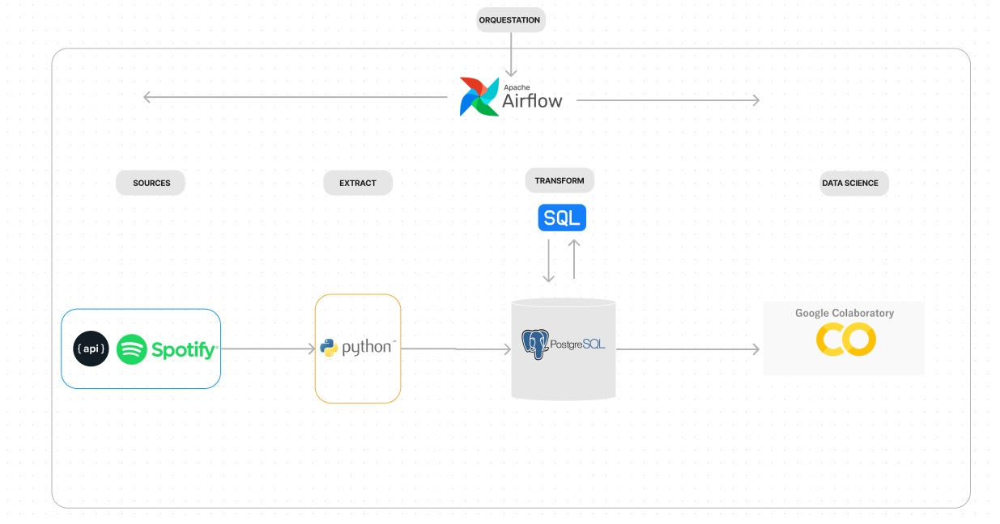
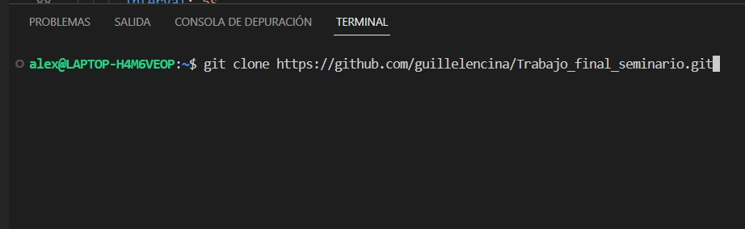
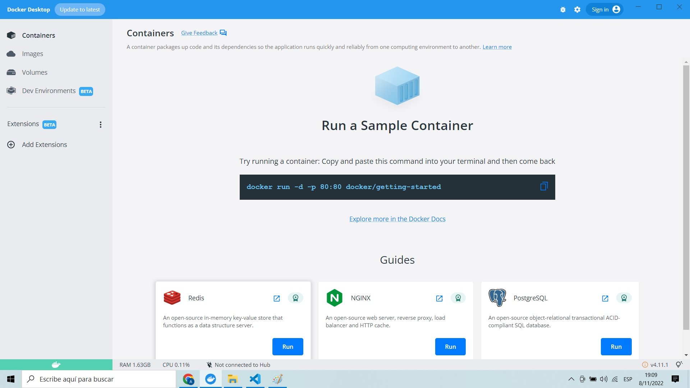
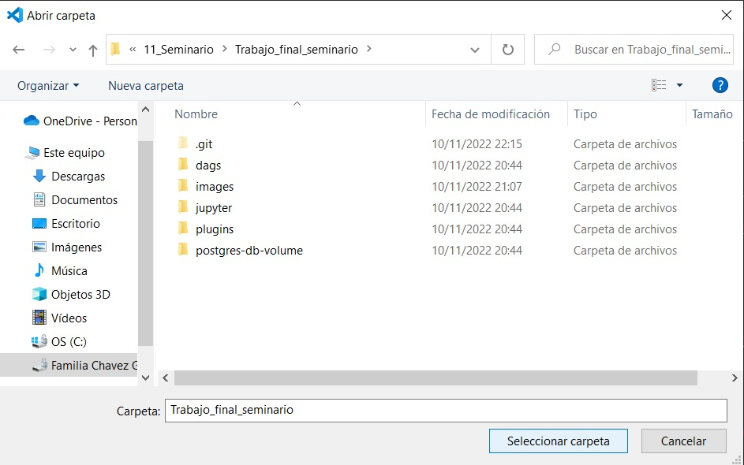
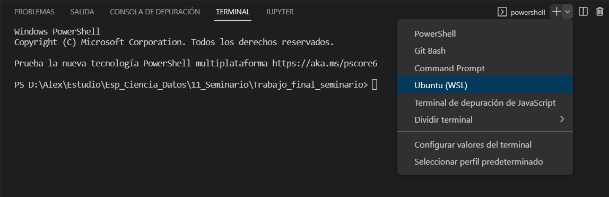
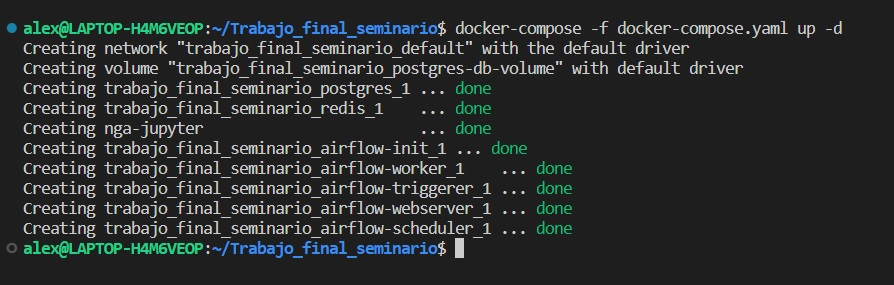
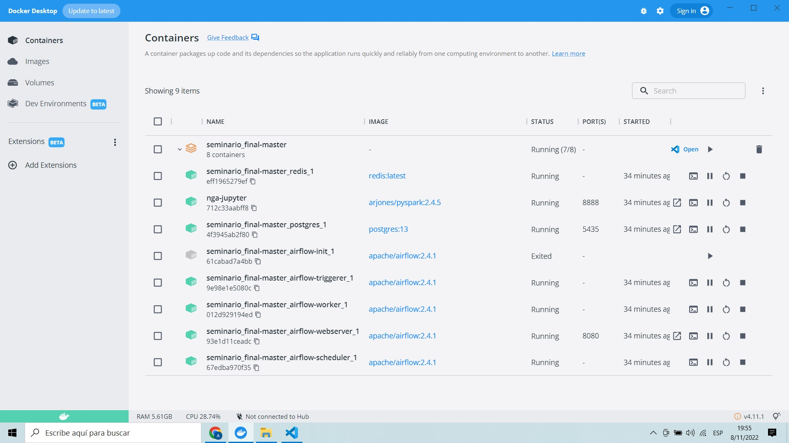
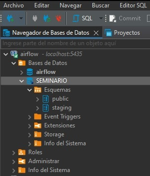
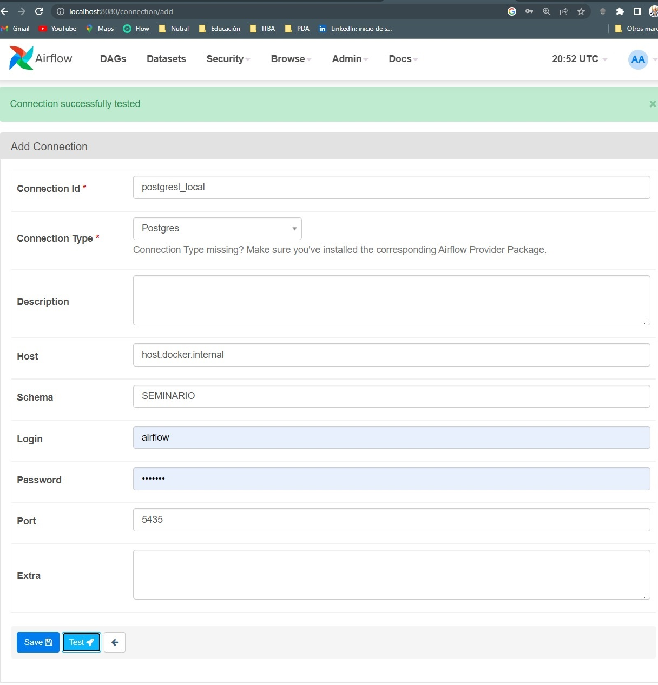
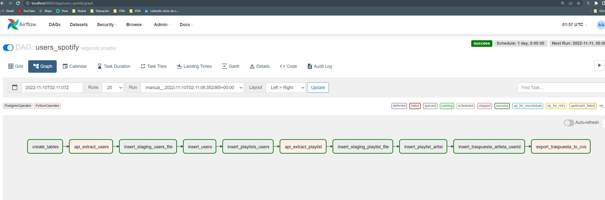

# Seminario de Tópicos Avanzados en Datos Complejos
### Especialización en ciencia de datos ITBA  
  
  
  
Docentes:   
Pedro Ferrari | pedro@muttdata.ai  
Juan Martín Pampliega | jpamplie@itba.edu.ar  

Estudiantes:      
Guillermo Lencina | glencina@itba.edu.ar | [LinkedIn](https://www.linkedin.com/in/guillermolencina/)     
Nicolas Arosteguy | narosteguy@itba.edu.ar | [LinkedIn](https://www.linkedin.com/in/nicol%C3%A1s-arosteguy-a564a97a/)   
Alexander Chavez | achavezmontano@itba.edu.ar | [LinkedIn](https://www.linkedin.com/in/alexchavez1980/)      
  
  
## Objetivo    
  
Obtener datos sobre que artistas que escuchan los usuarios en sus playlists publicas con el fin de prototipar la extracción, el procesamiento, y los análisis de la información para un futuro sistema de recomendacion basado en las coincidencias de artistas entre los usuarios.  
  

## Workflow 
  

  
  
## Resumen

Se consultarán dos API's publicas de spotify, una con información de usuarios y sus playlist y otra con la información de las playlist perse.  
  
En una primera instancia y mediante un script de python (y con usuarios pre-seleccionados manualmente) se obtienen datos de los mismos que contienen las playlist que tengan creadas.  
  
La salida del response es almacenada en un csv (users_file.csv) sin tranformar, y subido a la base de datos SEMINARIO en el schema staging (donde almacenaremos los csv en tablas sin transformar).  
  
Luego mediante Queries de SQL se ejecutan diferentes transformaciones para lograr extraer y estructurar de la tabla de staging de usuarios tanto los datos de los mismos como sus playlist.  
  
Una vez construidas las tablas de usuarios y playlist en el eschema public , con un segundo script de python obtenemos estos id de playlist ya procesados y consultamos la API de playlist, de donde obtenemos un 2do csv (playlist_file.csv) que será almacenado también en el schema de staging, sin procesar.  
  
Nuevamente con Queries SQL extraemos y estructuramos la tabla de playlist_artist, en donde vamos a poder obtener que artistas contiene cada playlist.  
  
Por último, con SQL, se genera una tabla con información (user_id, artista), vinculando todos los artistas que se hayan encontrado en las playlist con sus respectivos usuarios.  
  
Esta ultima información es exportada en un csv (export_colab.csv) para ser el input del colab y empezar con los algoritmos de clusterización.  
  
Todas estas tareas estarán osquestadas mediante operadores de airflow ( Postgres Operators y Python Operators)  
  
    
## Infraestructura/arquitectura  
  
  
Nuestro _docker-compose.yaml_ contiene 3 servicios: 

* Un container para jupyter (quedó estable pero no pudimos usarlo porque no encontramos la forma de instalar las librerías en el docker compose).
  
* Uno para Airflow.

* Y un tercero para postgres.  

* ~~BDT~~:
  
Inicialmente quisimos usar DBT para la ingesta de los _.csvs_ generados por los archivos de python mediante el comando dbt seed, y adicionalmente hacer todas las transformaciones de los datos con ésta herramienta. Esto nos permitía crear modelos (tablas) declarando sentencias SQL y abstrayéndonos de la estructura de las tablas. Todas las pruebas con DBT funcionaron en entornos locales, pero a la hora de levantar el container tuvimos problemas para dejarlo estable (estado _exited_). 
  
La solución a ésto fue utilizar operadores de postgres directamente desde Airflow para realizar las ingestas de los _.csvs_ y las transformaciones de los datos.
  
  
* Colab:  
  
Originalmente con el servicio de jupyter ibamos a obtener los datos haciendo una consulta directamente a la BD con la librería _sqlalchemy_. Sin embargo, al no poder instalar éstas librerías reemplazamos por Colab, que es una herramienta externa: por lo cual, se creó un phyton operator dentro de Airflow para realizar ésta consulta y generar un _csv._ que pueda ser importado desde Colab sin inconvenientes.  
  
  
Las librerías estandar usadas: [Numpy](https://numpy.org/), [pandas](https://pandas.pydata.org/), [seaborn](https://seaborn.pydata.org/) y [matplotlib](https://matplotlib.org/).  
Para preprocesamiento: [Sklearn](https://scikit-learn.org/stable/).  
Grafos: [Networkx](https://networkx.org/).  

[La tabla final se obtiene desde la siguiente ruta:](dags/csv)

[El colab se encuentra en el siguiente link:](https://colab.research.google.com/github/guillelencina/Trabajo_final_seminario/blob/master/red_spotify.ipynb#scrollTo=aazLisBb2CO-)
  
  
## Pasos para replicar el ambiente

1. Clonar repo: git clone https://github.com/guillelencina/Trabajo_final_seminario.git

2. Abrir _Docker Desktop_ para visualizar desde la interfaz.

3. Desde VSCode, abrir la carpeta _Trabajo_final_seminario_.

4. Ejecutar una consola de Ubuntu.

5. Ingresar a la carpeta: cd seminario_final-master

6. Ejecutar el comando: docker-compose -f docker-compose.yaml up -d

* El docker-compose es un archivo yaml/yml para crear todos los containers necesarios y a la vez.
* Una vez ejecutado, deben aparecer todos los containers OK como indica la imagen.

* También los podés chequear en la interfaz gráfica de Docker.

## Configuraciones adicionales
  
  
* El servicio de postgres que se encuentra en el docker compose está siendo utilizado por Airflow como BD para su propia metadata. Para aprovechar éste servicio decidimos usar la misma conexión y generar una BD adicional para nuestro proyecto. Nos conectamos a través de dbeaver a la BD de Airflow por única vez, y desde allí se crea la BD SEMINARIO y dentro de esta, el esquema de staging: 

## Airflow    
  
* Por única vez, en el webserver de Airflow se debe dar de alta la conexión a la BD generada:
  

  
  
Usamos como orquestador a Airflow.  
  
Con él, se elabora una secuencia de tareas que pueden ser monitoreadas y  
controladas desde la interfaz gráfica: [Airflow](http://localhost:8080).  
El único archivo _users_spotify.py_ contiene la creación/configuración de las tareas del DAGs (Directed acyclic graph) de Airflow.  

### DAG:
  
  
  
  
  
La secuencia de tareas es la siguiente:  
  
create_tables >> api_extract_users >> insert_staging_users_file >> insert_users >> insert_playlists_users >> api_extract_playlist >> insert_staging_playlist_file >> insert_playlist_artist >> insert_traspuesta_artista_userid >> export_traspuesta_to_cvs_i
  
* create_tables:  A través de un _postgresOperator_ accedemos a la carpeta dags/sql/ y creamos las tablas.  
En _create_tables.sql_ se encuentra la creación de las tablas: 
  
Esquema _staging_ para almacenar los _csvs_ sin transformar, resultado de las llamadas a las APIs: 
  
_staging.users_file_  
_staging.playlist_file_  

Esquema _public_ para simular un entorno mas formal productivo y almacenar los datos transformados y finales:  
  
_public.users_  
_public.playlists_  
_public.playlists_artists_  
_public.traspuesta_artista_user_ (esta tabla es la preparada para hacer el input del Colab)  

* **api_extract_users**: Es un _pythonOperator_ que ejecuta la primer llamada a la API de usuarios preseleccionados manualmente.  
Queda como resultado el archivo _users_file.csv_.  
  
* **insert_staging_users_file**: Es un _postgresOperator_ que inserta el _users_file.csv_ en la tabla staging.users_file.
    
* **insert_users**: _postgresOperator_ que extrae información relevante de staging.users_file e insertamos en la tabla de usuarios.  
  
* **insert_playlists_users**: _postgresOperator_ que extrae información relevante de la playlist de staging.users_file e insertamos en la tabla de playlist.  
    
* **api_extract_playlist**: Es un _pythonOperator_.  
Toma de la BD los IDs de las playlist cargados previamente y ejecuta la segunda llamada a la API, en este caso de playlist.  
Queda como resultado el archivo _playlist_file.csv_.
    
* **insert_staging_playlist_file**: Es un _postgresOperator_ que inserta el _playlist_file.csv_ en la tabla staging.playlist_file.  
    
* **insert_playlist_artist**: _postgresOperator_ que inserta en la tabla public.playlists_artists los IDs de las playlist y los artistas que la componen.  
    
* **insert_traspuesta_artista_userid**: _postgresOperator_ que inserta en la tabla public.traspuesta_artista_user los IDs de usuarios vinculados a los nombres de los artistas que se hayan encontrado en sus playlist.
  
* **export_traspuesta_to_cvs_i**: Es un _pythonOperator_ que consulta la tabla public.traspuesta_artista_user y genera el export_colab.csv para ser el input del Colab.  
  
**Disclaimer**: Los operadores insert_staging_users_file insert_staging_playlist_file requieren de un copy manual vía linux:  
  
_cp /dags/csv/users_file.csv postgres-db-volume_  
_cp /dags/csv/playlist_file.csv postgres-db-volume_  
  
Se intentó hacer un "bash-operator" sin éxito que resuelva ésta copia de manera automatizada en Airflow.  
Nos encontramos con problemas debido a que posiblemente se necesiten permisos de root para realizar ésta acción en el volúmen de postgres.  
  
[Colab](https://colab.research.google.com/github/guillelencina/Trabajo_final_seminario/blob/master/red_spotify.ipynb#scrollTo=aazLisBb2CO-)
  
  
ITBA &copy; 2021/2022  
